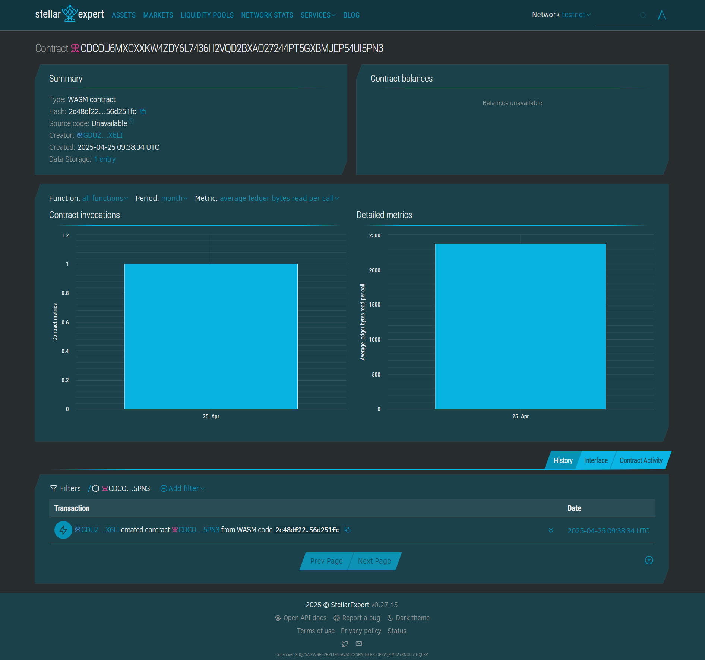

# Homeless Shelter Locator Smart Contract

## 📘 Project Title
**Homeless Shelter Locator App**

## 📄 Project Description
This project provides a decentralized smart contract-based system to register, track, and manage the data of homeless shelters using the Soroban smart contract platform. Each shelter entry contains location, capacity, contact info, and occupancy status.

## 🎯 Project Vision
To create a transparent, decentralized solution that helps individuals find nearby shelters in real-time while giving NGOs and governments a way to register and manage shelter data securely.

## 🌟 Key Features
- 🏠 **Add Shelter:** Authorized users (admins) can register a new homeless shelter.
- 🔍 **Get Shelter Info:** Users can query a shelter's location, capacity, and contact info.
- 🔁 **Update Occupancy:** Admins can update the number of people currently accommodated.
- 📦 **Persistent Ledger Storage:** Uses Soroban’s instance storage for secure, tamper-proof records.

## 🚀 Future Scope
- 🌍 **Geolocation Filtering:** Add support for location-based shelter search.
- ✅ **Verification System:** Validate shelters through trusted authority credentials.
- 📱 **Mobile App Integration:** Integrate with a frontend or mobile app.
- 📊 **Analytics Dashboard:** Monitor shelter usage, demand, and availability trends.
- 💬 **Chat or Call Feature:** Connect people in need with shelter coordinators.

## Contract Details
CDCOU6MXCXXKW4ZDY6L7436H2VQD2BXAO27244PT5GXBMJEP54UI5PN3

